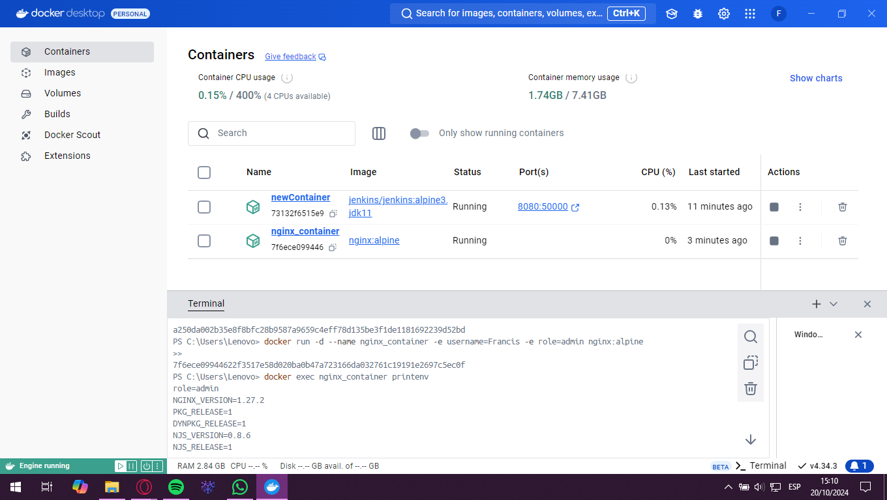
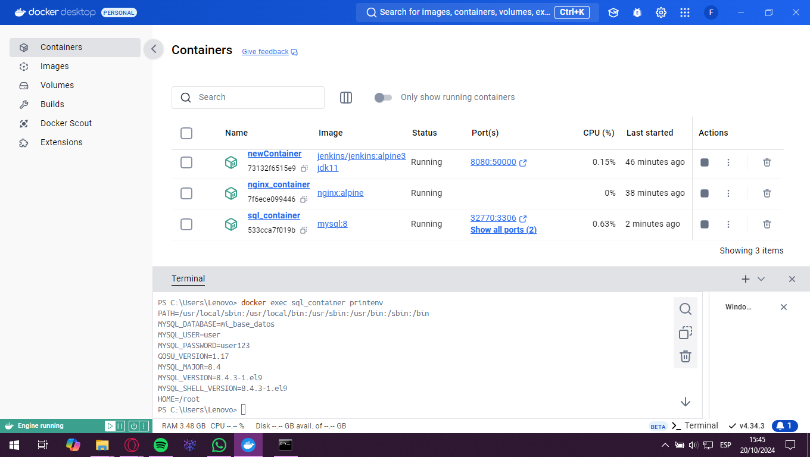
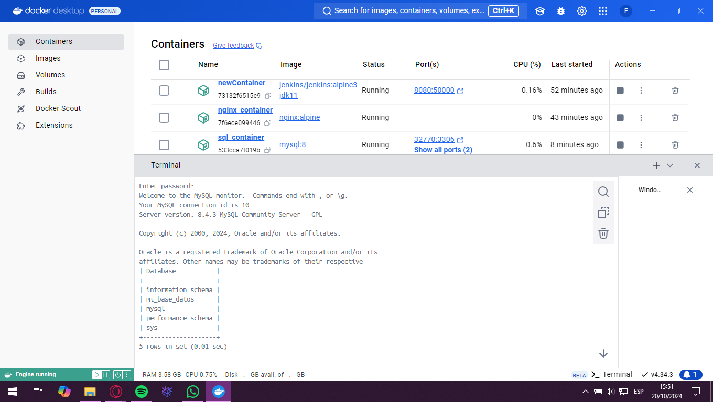

# Variables de Entorno
### ¿Qué son las variables de entorno
Las variables de entorno son valores clave que se definen en el entorno de ejecución de un contenedor y que pueden influir en el comportamiento de las aplicaciones dentro de dicho contenedor. Estas variables se utilizan para configurar aspectos importantes como rutas, credenciales o modos de ejecución sin necesidad de modificar el código fuente de las aplicaciones.

### Para crear un contenedor con variables de entorno?

```
docker run -d --name <nombre contenedor> -e <nombre variable1>=<valor1> -e <nombre variable2>=<valor2>
```

### Crear un contenedor a partir de la imagen de nginx:alpine con las siguientes variables de entorno: username y role. Para la variable de entorno rol asignar el valor admin.

```
docker run -d --name nginx_container -e username=Francis -e role=admin nginx:alpine
```



### Crear un contenedor con mysql:8 , mapear todos los puertos

```
docker run -P -d --name sql_container mysql:8
```

### ¿El contenedor se está ejecutando?
No, no se está ejecutando el contenedor

### Identificar el problema
No se ha proporcionado la contraseña para el usuario root de MySQL, que es un requisito obligatorio al ejecutar un contenedor de MySQL por primera vez. El comando que ejecutaste no incluye la variable de entorno MYSQL_ROOT_PASSWORD, que es necesaria para que el servidor MySQL inicie correctamente. Sin esta contraseña, el contenedor puede detenerse automáticamente poco después de crearse. 

### Eliminar el contenedor creado con mysql:8 

```
docker rm -f sql_container
```

### Para crear un contenedor con variables de entorno especificadas
- Portabilidad: Las aplicaciones se vuelven más portátiles y pueden ser desplegadas en diferentes entornos (desarrollo, pruebas, producción) simplemente cambiando el archivo de variables de entorno.
- Centralización: Todas las configuraciones importantes se centralizan en un solo lugar, lo que facilita la gestión y auditoría de las configuraciones.
- Consistencia: Asegura que todos los miembros del equipo de desarrollo o los entornos de despliegue utilicen las mismas configuraciones.
- Evitar Exposición en el Código: Mantener variables sensibles como contraseñas, claves API, y tokens fuera del código fuente reduce el riesgo de exposición accidental a través del control de versiones.
- Control de Acceso: Los archivos de variables de entorno pueden ser gestionados con permisos específicos, limitando quién puede ver o modificar la configuración sensible.

Previo a esto es necesario crear el archivo y colocar las variables en un archivo, **.env** se ha convertido en una convención estándar, pero también es posible usar cualquier extensión como **.txt**.
```
docker run -d --name <nombre contenedor> --env-file=<nombreArchivo>.<extensión> <nombre imagen>
```
**Considerar**
Es necesario especificar la ruta absoluta del archivo si este se encuentra en una ubicación diferente a la que estás ejecutando el comando docker run.

### Crear un contenedor con mysql:8 , mapear todos los puertos y configurar las variables de entorno mediante un archivo

```
docker run -d --name sql_container --env-file="C:\Users\Lenovo\Desktop\mysql.env" -P mysql:8
```



### ¿Qué bases de datos existen en el contenedor creado?

```
docker exec -it sql_container mysql -u root -p 
```

(se coloca la contraseña establecida en el archivo de configuraciones "12345")

```
show DATABASES;
exit
```


